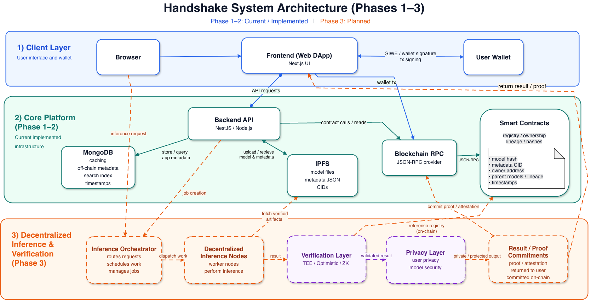

# Handshake

Handshake is a decentralized AI model hub for verifiable model provenance and future decentralized AI inference.
It is designed to answer a simple question: when an AI model is shared, reused,
fine-tuned, or registered by someone else, how can users verify what the model
artifact is, who registered it, where its metadata lives, and how it relates to
other models?

## Overview

Open AI model distribution is still largely centralized. Model files can be
hosted, renamed, replaced, forked, or reused across platforms without a durable
cryptographic record that binds the artifact to an owner, metadata, and lineage.
Handshake focuses on this missing trust layer.

The system anchors model identity through:

- local BLAKE3 hashing of uploaded model artifacts
- decentralized artifact and metadata storage through IPFS
- wallet-based ownership via Sign-In with Ethereum
- immutable provenance records on Avalanche Fuji
- parent-child lineage between registered models
- off-chain provenance badges that summarize registration and metadata quality

Handshake does not claim that a registered model was trained honestly or that
every future inference was executed correctly. Its purpose is narrower and more
foundational: to establish a verifiable model identity layer that later inference
verification systems can rely on.

## Live Demo

The deployed demo is available for review at:

- Web app: https://app.handshake-demo.com
- API docs: https://api.handshake-demo.com/docs

For most reviewers, we recommend using the hosted demo instead of running the
repository locally.

## System Architecture



Handshake is split into five main components:

- Browser client: model upload flow, local hash computation, wallet signatures,
  and on-chain transaction submission.
- Application server: authentication, model metadata, IPFS coordination, REST
  API, and blockchain synchronization.
- MongoDB: application cache and query layer for model records.
- IPFS: decentralized storage for model artifacts and metadata CIDs.
- ModelRegistry smart contract: Avalanche Fuji registry that stores the
  tamper-evident model hash, owner, metadata CID, and on-chain parent hashes.

## How The Registry Works

In the normal flow, a user connects a browser wallet, uploads model files, and
the browser computes a BLAKE3 model hash before upload. Artifacts are stored on
IPFS, metadata is stored as a separate IPFS object, and the API creates an
off-chain model record. The user then signs the on-chain registration
transaction, which anchors the model in `ModelRegistry.sol`.

The backend watches registry events and reconciles blockchain state back into
MongoDB, so the public registry can show API metadata together with on-chain
registration status, transaction hashes, owners, and lineage.

The contract can also be used directly outside the web app. The current public
catalog remains API-first: raw contract-only registrations are not automatically
published unless they match an existing Handshake model record.

For a deeper implementation-level explanation, see [Architecture.md](./Architecture.md).

## Local Requirements

Running the full stack locally is not the recommended review path. The app
depends on external infrastructure and wallet/network setup. If you still want
to run or develop it locally, you need:

- Node.js `>=20`
- pnpm `>=10`
- a hosted MongoDB connection string
- a Pinata account with JWT and gateway domain
- a browser wallet such as MetaMask or another WalletConnect-compatible wallet
- Avalanche Fuji RPC access
- Fuji testnet AVAX for wallets that register models on-chain
- the deployed `ModelRegistry` address, or a local/Fuji deployment from
  `packages/contracts`

Create an environment file from the example:

```bash
cp .env.example .env
```

The most important values are:

```bash
MONGO_URI=
CLIENT_URL=http://localhost:3000
NEXT_PUBLIC_API_URL=http://localhost:4000

PINATA_JWT=
PINATA_GATEWAY=

CHAIN_ID=43113
AVALANCHE_FUJI_RPC=https://api.avax-test.network/ext/bc/C/rpc
MODEL_REGISTRY_ADDRESS=
MODEL_REGISTRY_DEPLOY_BLOCK=
```

Install dependencies and start the development servers:

```bash
pnpm install
pnpm dev
```

Local addresses:

- Web: http://localhost:3000
- API: http://localhost:4000
- Swagger: http://localhost:4000/docs

## Repository Layout

- `apps/web`: Next.js browser application
- `apps/api`: NestJS API and blockchain synchronization layer
- `packages/contracts`: Solidity registry contract, ABI, and deployment data
- `packages/types`: shared DTOs and type definitions
- `packages/config`: shared runtime configuration helpers

## Deployment

Production uses separate API and web images behind Caddy:

- `handshake-api:local` or `API_IMAGE`
- `handshake-web:local` or `WEB_IMAGE`

The GitHub Actions deployment workflow builds Linux AMD64 images with Turbo
prune and Docker BuildKit cache, pushes them to GHCR, then updates the Droplet
with `docker compose pull` and `docker compose up -d --no-build`.

CI/CD expects these GitHub Actions secrets:

- `DROPLET_HOST`
- `DROPLET_USER`
- `DROPLET_SSH_KEY`
- `GHCR_USERNAME`
- `GHCR_READ_TOKEN`

And these GitHub Actions variables:

- `NEXT_PUBLIC_API_URL`
- `NEXT_PUBLIC_WALLETCONNECT_PROJECT_ID`

## Useful Commands

```bash
pnpm build
pnpm check-types
pnpm --filter @handshake/api check-types
pnpm --filter @handshake/web check-types
pnpm --filter @handshake/contracts build
```
<<<<<<< Updated upstream

## Docker Deployment

Production deployment icin repo iki image kullanir:

- `handshake-api:local`
- `handshake-web:local`

Caddy, `WEB_DOMAIN` ve `API_DOMAIN` ile web/API reverse proxy ve HTTPS terminasyonunu yapar. Deployment env degerleri `.env.example` dosyasindaki alanlara gore doldurulur.

Sunucuda image'lar hazirsa uygulamayi baslatmak icin:

```bash
docker compose up -d --no-build
```

GitHub Actions workflow'u `master` push'unda image'lari `linux/amd64` olarak build eder, Droplet'e yukler ve `docker compose up -d --no-build` ile deploy eder.

## Sorun Giderme

Pull sonrasi `Cannot find module` hatasi alirsan:

```bash
pnpm install
```

`3000` veya `4000` portu doluysa eski dev process'lerini kapatip tekrar calistir.

Disk dolduysa ve Next cache buyuduyse generated cache'i silebilirsin:

```bash
rm -rf apps/web/.next
```
=======
>>>>>>> Stashed changes
